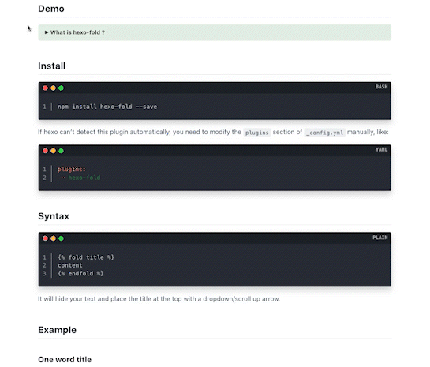

一个用于折叠内容块的插件，修改自 [hexo-sliding-spoiler](https://github.com/fletchto99/hexo-sliding-spoiler)。

[English](https://github.com/AimTao/hexo-fold/blob/master/README_CN.md) | 中文

> 原作的标签和 hexo-spoiler 插件冲突，给原作提了 pr，但是考虑到还有部分用户在用，更改标签名称无法向后兼容，会引起诸多麻烦。
> 这里参考 hexo-sliding-spoiler，更改了 tag，修复了几个 bug，修改了样式，增加支持用户自定义颜色的功能，使用愉快~

+ [x] 简单、高效、美观
+ [x] 支持文本、图片、代码块等
+ [x] 自适应，容量超大
+ [x] 用户自定义颜色

## 演示



## 安装


```bash
npm install hexo-fold --save
```

如果 hexo 无法自动检测到该插件，您需要手动修改 `/_config.yml` 文件中的 `plugins` 部分，如下所示：


```yaml
plugins:
  - hexo-fold
```

如果您想自定义颜色，请添加以下配置。
这是可选的，如果未配置，将使用默认颜色。

```yaml

fold:
  bg_color: "#e5efe7"
  board_color: "#e5efe7a1"
  text_color: "#353535"
```

## 用法

```plain

内容

```

它会隐藏您的文本，并将标题置于顶部，并带有一个下拉/向上滚动箭头。

## 示例

### 单个词作为标题

```plain

内容

```

### 包含空格的标题

```plain

content

```
